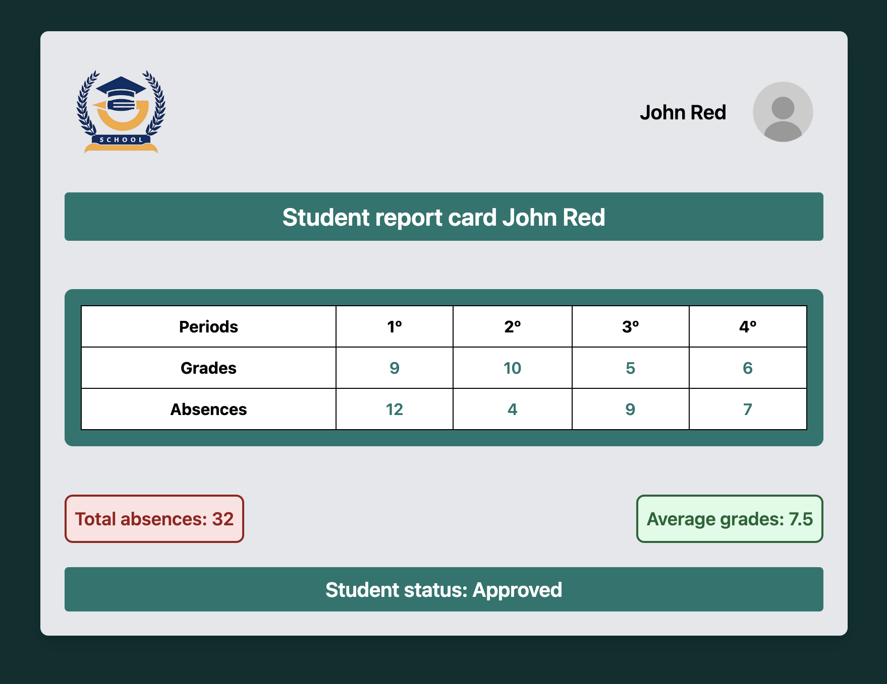

# 📄 School Report Project 🎓👨🏻‍🏫

## 🔧 About the Project

This project is a simple interactive web application designed to generate a student's school report based on user inputs for grades and absences across four periods.

It features:

- Data input validation to ensure accurate entries.
- Calculation of average grades and total absences.
- Status determination (“Failed”, “Recovery”, or “Approved”) based on grades and attendance.
- Responsive UI styled with Tailwind CSS.

## 🔄 How It Works

1. The application requests the student's full name.
2. Users are prompted to enter the grades and absences for each of the four periods.
3. Input validation checks ensure grades fall between 0 and 10 and absences between 0 and 40.
4. The report displays:
   - Grades per period
   - Absences per period
   - Total absences and average grade
   - Final status message, including specific cases like "Failed due to absences" or "Approved with excellence!"
5. Errors are highlighted when invalid data is detected.

## 📝 Technologies Used

- **HTML**
- **JavaScript**
- **Tailwind CSS**

## 📊 Example Output

## 📖 Features

- **Error Handling:** Displays custom error messages for invalid data inputs.
- **Dynamic UI:** Fills in report details based on user-provided data.
- **Performance:** Simple, lightweight, and responsive interface.

## ✨ Usage Instructions

1. Clone the project or download it to your local environment.
2. Open `index.html` in your browser.
3. Enter the requested information as prompted.
4. Review the generated report.

## 🔍 View the Project

Click [here](https://school-report-app.netlify.app/) to view the project directly.

## ✨ Contributions

Feel free to clone, explore, and provide feedback on my projects. Each one is a stepping stone toward becoming a skilled front-end developer!

### 📫 Get in touch:

You can reach me on [LinkedIn](https://www.linkedin.com/in/andreaguarneri) or follow my progress on GitHub for more exciting projects!
